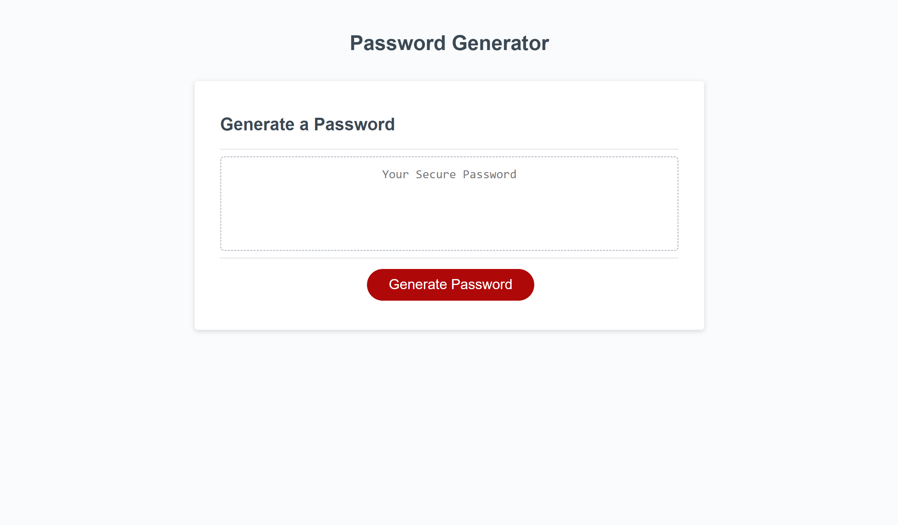
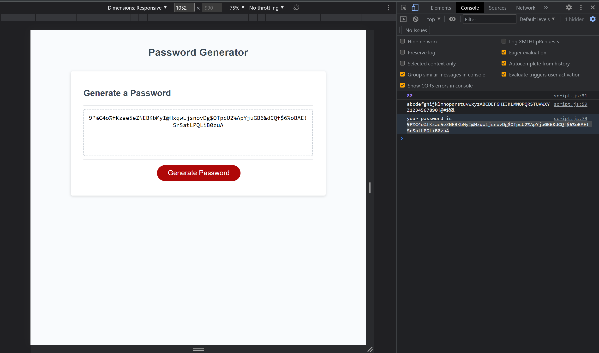

# Secure Random Password Generator
## Table of contents
​
- [Overview](#overview)
 - [The challenge](#the-challenge)
 - [Screenshot](#screenshot)
 - [Links](#links)
- [My process](#my-process)
 - [Built with](#built-with)
 - [What I learned](#what-i-learned)
 - [Continued development](#continued-development)
 - [Useful resources](#useful-resources)
- [Author](#author)
- [Acknowledgments](#acknowledgments)
​
## Overview
​
### The challenge
​
Users should be able to:
​
- Develop a script.js file with variables and functions
- Use loops and prompts to let clients make selections
- Use event listeners to add dynamic abilities to the HTML file
​
### Screenshot
​

​
### Links
​
- Github Repo - [appleschaussaa/password-generator](https://appleschaussaa.github.io/password-generator)
​
## My process
​
### Built with
​
- Javascript
- HTML & CSS
​
### What I learned
​
Upon going back over this project being able to use my further developed knowledge to spot common mistakes was interesting. For instance I was trying to use returns in the character selection loop which would have stopped the loop as soon as it was read. Also where I was trying to take the character selection and randomize/put in the length was flawed ever so slightly. The last thng was when starting to work on it again I forgot I made changes to the README in my Github repo so when trying to push my local file changes it messed things up and had to figure out how to resolve that.
​
### Continued development
​
The are probably ways I can make this more efficient or ways to combine sections to work together instead of seperate part. Also being able to cancel out of the prompts at the beginning does not seem to work as well as I wanted.

### Useful resources
​
- [Resource 1](https://developer.mozilla.org/en-US/docs/Web/JavaScript) - very in depth for looking into every aspect of Javascript
- [Resource 2](https://developer.mozilla.org/en-US/docs/Web/JavaScript/Reference/Statements/while) - Helped with learning about while loops as that seems to be the preferred loop type
- [Resource 4](https://www.w3schools.com/jsref/jsref_while.asp) - shows that if statements can coincide with while statements
- [Resource 5](https://betterprogramming.pub/stop-putting-so-many-if-statements-in-your-javascript-3b65aaa4b86b) - shows how to make a clean if statement within a function, tried to make a look up map work but could not
- [Resource 6](https://www.geeksforgeeks.org/random-string-generator-using-javascript/) - helps get an idea on randomizing and tooks ideas from it that applied to what we had learned so far then used other techniques we had learned to make it all fit together
​
## Author

Robert Schauss
- GitHub - [appleschaussaa](https://github.com/appleschaussaa/)
​
## Acknowledgments

There were a good amount of support that helped me get this far on the project. The instructer and TAs have been a huge help in class and office hours. All the online resources and forums discussing problems and ideas on how to fix were nice to stumble upon. The roadmap in the modules gave an almost endless amount of topics to read through. As mentioned in the What I Learned Section, I had problems with making changes locally and conflicting with the repo changes, the TAs were very helpful with that issue.